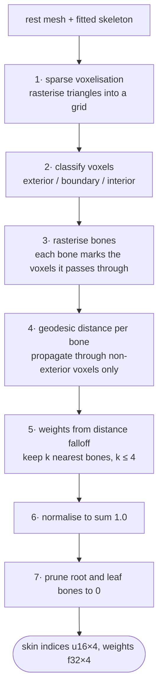

# Geodesic Voxel Binding

**Status:** R-2 · design doc, not yet implemented (P1-3 … P1-6)
**Decision:** default skinning solver — see `memory/architecture.md` ADR A2

## Problem

Given a rest-pose mesh and a fitted skeleton, decide how strongly each bone
deforms each vertex. In artist terms: when the elbow bends, which parts of the
sleeve follow it, and how smoothly does the influence fade into the forearm and
the upper arm?

The legacy solver answers this with the **Euclidean** distance from a vertex to
each bone's midpoint, then takes the single nearest bone
(`legacy/src/lib/solvers/WeightCalculator.ts:71-80`). Euclidean distance travels
through empty space, so a hand resting beside a hip is "near" the hip bone even
though no flesh connects them. Measured on the shipping templates
(`bench/baselines/legacy-solver.json`): **68% of vertices end up with a single
bone influence**, mean 1.13–1.81 influences per vertex against a GPU limit of 4.

## Approach

Measure distance **through the inside of the mesh** instead of through space.
Two points on either side of an air gap are then correctly far apart.



The critical step is **4**: propagation is confined to non-exterior voxels, so a
path from the hip to the hand must travel up the torso, along the arm and down
the forearm. The air gap is not a shortcut. This is what removes the failure
mode that `ArmWeightCorrector` and `ExtremityWeightCorrector` were written to
patch.

## Why voxels rather than a tetrahedral mesh

Bounded Biharmonic Weights needs the volume bounded by the surface to be
tetrahedralised. Real artist meshes are frequently non-watertight, non-manifold,
self-intersecting, or several disconnected components, and tetrahedralisation
either fails outright or produces garbage on exactly those inputs.

Voxelisation degrades gracefully instead: a hole in the surface makes some
voxels ambiguous, not the whole solve impossible. The paper is explicit that
this is the production motivation, and it is why Maya ships the method.

## Citation

Olivier Dionne and Martin de Lasa. *Geodesic Voxel Binding for Production
Character Meshes.* Proc. 12th ACM SIGGRAPH/Eurographics Symposium on Computer
Animation (SCA), July 2013. DOI [10.1145/2485895.2485919](https://dl.acm.org/doi/10.1145/2485895.2485919)

Extended version, focused on degenerate geometry: Dionne and de Lasa,
*Geodesic Binding for Degenerate Character Geometry Using Sparse Voxelization*,
IEEE TVCG, October 2014. [IEEE Xplore 6809992](https://ieeexplore.ieee.org/document/6809992/)

Verified from the published abstracts (2026-08-29):

> "…production meshes that may contain non-manifold geometry, be non-watertight,
> have intersecting triangles, or comprise multiple connected components."

> "…binding weights, based on the geodesic distance between each voxel lying on
> a skeleton bone and all non-exterior voxels."

> "…smooth weights at interactive rates, without time-constants, iteration
> parameters, or costly optimization at bind or pose time."

> "By decoupling weight assignment from distance computation the method makes it
> possible to modify weights interactively, at pose time, without additional
> pre-processing or computation."

That last property matters for us beyond performance: it is what lets an artist
adjust falloff and see the result immediately, which is the calibration knob
`memory/philosophy.md` insists on leaving in.

**Source note:** the authors' project page (`delasa.net/voxelization/`) is dead —
the domain now redirects to an unrelated site. Use the ACM and IEEE versions.

## Not yet verified — resolve before implementing

The abstracts do not pin these down, and **they must not be guessed**:

| Unknown | Why it matters | How to resolve |
|---|---|---|
| Geodesic propagation algorithm — Dijkstra, fast marching, or weighted flood fill | determines accuracy and whether it parallelises per bone | read the full SCA 2013 paper |
| Exact weight falloff function from distance | directly sets deformation smoothness | full paper; otherwise pick and document our own |
| Interior/exterior classification for open surfaces | the whole robustness claim rests on this | the 2014 TVCG version targets precisely this |
| Reported timings and mesh sizes | to sanity-check our budget | full paper |

Until the full text is read, this document describes the **shape** of the
algorithm, not its exact numerics. Do not cite performance figures for this
method anywhere until they come from the paper.

## Complexity

With `n` vertices, `b` bones, `v` occupied voxels:

- Voxelisation: `O(triangles)` to rasterise, `O(v)` memory for a sparse grid
- Classification: `O(v)` flood fill from the grid boundary
- Geodesic distance: `O(b · v log v)` for Dijkstra-style propagation, and the
  per-bone loop is embarrassingly parallel → `rayon`
- Weight lookup: `O(n · k)` with `k ≤ 4`

Voxel resolution is the single quality/memory dial. Memory grows roughly with
the square of resolution for a surface-sparse grid, which is how the solve is
kept inside the 1.5 GB budget in `memory/test.md` §6.

## Robustness — must be stated, not assumed

| Input defect | Expected behaviour | Test |
|---|---|---|
| non-watertight | interior classification degrades locally, solve completes | P1-7 |
| self-intersecting | unaffected; voxels are occupancy, not topology | P1-7 |
| disconnected components | **see below — this is the big one** | P1-7 |
| zero-area / degenerate triangles | skipped at rasterisation | P1-2 |
| thin features (fingers, fins, primaries) | **risk: missed below the voxel size** — needs adaptive resolution | P1-3 |
| mesh in cm vs m | scale-invariant after normalising grid to the bounding box | P1-7 invariant 7 |

The thin-feature case is the known weakness and the one to measure early: bird
primaries and fish fins are exactly the creatures this project exists to serve.

### Disconnected components are the normal case, not an edge case

Measured on `legacy/static/test-files/human-small.glb` — all 3 meshes merged
with world transforms baked, 8691 verts / 13721 tris — at the default weld
epsilon:

| | |
|---|---|
| connected components | **61** |
| duplicate (seam-split) vertices | 1698 |
| boundary edges (open surface) | 26 |
| non-manifold edges | 1 |
| watertight | **no** |

A character is eyes, teeth, tongue, lashes and clothing as well as a body. The
count is not an artefact of the weld epsilon: it holds at 61 across 1e-7 to
1e-5 of the diagonal, reads 116 unwelded, and only collapses once welding
starts fusing distinct surfaces — by 1e-3 it has turned 2890 of 13721 real
faces into slivers.

**Consequence for the solver.** Geodesic distance cannot propagate between
disconnected islands, so a naive implementation gives every vertex of the eyes
and teeth **zero weight from every bone** — they would detach and float. This
must be designed for in P1-4/P1-5, not patched later:

1. Voxelise all components into one shared grid. Islands that are spatially
   nested inside the body (eyes inside the head) become connected in voxel
   space even though they are disconnected as surfaces — which is the correct
   answer, and a further reason the method is voxel-based rather than
   surface-based.
2. For islands that remain isolated after voxelisation, fall back to the
   nearest bone by Euclidean distance and record it in the mesh report so the
   UI can flag it. Never leave a vertex unweighted.
3. Invariant 4 in `memory/test.md` §3 (every vertex sums to 1.0) is what
   catches a regression here.

## Measured: voxelisation (P1-3, implemented)

Sweeping resolution on a real character (8691 verts, extent 0.81 × 0.76 × 0.15),
release build, Apple M4:

| resolution | surface | interior | interior/surface | volume | time | memory |
|---|---|---|---|---|---|---|
| 32 | 800 | 66 | 0.08 | 0.00108 | ~3 ms | 15 KB |
| 64 | 3224 | 1268 | 0.39 | 0.00259 | ~4 ms | 80 KB |
| 128 | 13370 | 15226 | 1.14 | 0.00389 | 8 ms | 490 KB |
| 192 | 30416 | 58354 | 1.92 | 0.00442 | 16 ms | 1.5 MB |
| **256** | 54608 | 146672 | **2.69** | **0.00469** | **30 ms** | **3.4 MB** |
| 384 | 124286 | 525292 | 4.23 | 0.00497 | 85 ms | 10.9 MB |

**The interior/surface ratio is the number that matters**, not the raw counts.
Below ~128 the grid is shell-dominated: thin limbs are entirely surface with no
interior between them, and the geodesic field would have almost nothing to
propagate through. 256 is the default — interior comfortably ahead of surface,
within ~6% of the converged volume, ~30 ms and 3.4 MB.

**Physical validation.** At 256 the interior volume is 0.00469 units³. The figure
is 0.764 units tall, so a 1.75 m human implies 2.29 m/unit and a volume scale of
12.0 → **56 litres**. A 60 kg person displaces roughly 60 litres. The voxeliser
reproduces real body volume, which is a stronger check than any internal
consistency assertion.

**Leak behaviour confirmed.** This mesh is *not* watertight (26 boundary edges,
1 non-manifold edge) and still encloses volume at every resolution tested,
because conservative rasterisation seals holes smaller than a voxel. A synthetic
box with a whole face removed does leak completely — that boundary is tested
both ways.

**Sealing an axis-aligned mesh took three separate fixes**, and the first
implementation failed badly without them — a plain unit cube produced *no shell
at all* at resolutions 13, 18 and 20, and leaked at 16 more. Organic geometry
hid this completely, because it never lands exactly on a voxel plane; a cube's
faces do, systematically, because the grid origin derives from the mesh bounds.

1. The rasterisation AABB excluded the voxel actually containing a boundary
   face — `coord_of` and the box centre round independently, so at resolution
   20 the face at x=0 fell in voxel 0 while `coord_of` reported voxel 1. The
   range is now widened by one voxel.
2. The overlap test had no epsilon, so exact touching was decided by a single
   ulp. Voxel boxes are now tested very slightly enlarged (1e-3 of a voxel).
3. Rasterisation ran in world space, losing precision for a small model far
   from the origin. It now runs in grid-local coordinates.

The regression sweep covers 3 scales × 4 offsets × 3 rotations × 41
resolutions = 1476 cases, all sealed.

## Measured: geodesic field (P1-4, implemented)

Template human, 7399 verts, 66-bone rig, resolution 256, release build on M4:

| | |
|---|---|
| compute time | **190 ms** (66 bones, `rayon`-parallel) |
| retained memory | 7399 × 66 × 4 = **1.9 MB** |
| unreachable bones | 0 |
| stranded vertices | 0 |

Memory is the design constraint. A distance field per bone over the whole grid
would be 66 × 3.4 M × 4 = **900 MB**, past the budget. Two things avoid it:
only non-exterior voxels participate (201 k of 3.4 M, a 17× reduction), and only
distances *at vertices* are retained — the field itself is per-thread scratch.

### How much this actually changes the result

For every vertex, the bone Euclidean distance picks (what the legacy
`WeightCalculator.ts:71-80` does) versus the bone geodesic distance picks:

| | |
|---|---|
| vertices whose dominant bone changes | **1080 of 7399 (14.6%)** |
| geodesic/Euclidean path ratio, p50 | 1.06 |
| p90 | 1.51 |
| p99 | 3.33 |
| **worst** | **19.4×** |

One vertex in seven is assigned to a different bone. The 19.4× worst case is
the "hand near the hip" failure directly: the Euclidean-nearest bone is
nineteen times further away when measured through the body.

**And this is a T-pose model**, where limbs are spread — the case most
favourable to Euclidean distance. An A-pose model, arms hanging beside the
ribcage, should be worse, which is the quantitative basis for objective O8.

### Resolution floor — the limit of that claim

Two surfaces closer than about **1.5 voxels** land in adjacent voxels, and the
path leaks between them, restoring the Euclidean shortcut. Measured on two
disconnected boxes at resolution 32 (voxel 0.094):

| gap | in voxels | result |
|---|---|---|
| 0.05 | 0.53 | leaks |
| 0.10 | 1.07 | leaks |
| 0.15 | 1.60 | separated |
| 0.20+ | 2.13+ | separated |

Inherent to voxel methods rather than a defect — a grid cannot resolve a gap it
cannot represent. At the default resolution on a 1.75 m human the voxel is about
7 mm, so the floor is roughly **1 cm**. An A-pose arm hangs 2–5 cm from the
ribcage and is resolved comfortably; an arm actually touching the body is not,
and arguably should not be. Raise the resolution for models with deliberately
narrow clearances. Pinned by a test so the threshold cannot drift unnoticed.

## Measured: full pipeline (P1-5/P1-6, implemented)

Template human, 7399 verts, 66-bone rig, resolution 256, release build. Same
model and rig as the legacy baseline in `bench/baselines/legacy-solver.json`:

| | legacy | geodesic | change |
|---|---|---|---|
| single-influence vertices | **87%** | **9.0%** | 10x fewer |
| mean influences per vertex | **1.13** | **3.66** | 3.2x |
| vertices needing fallback | — | 0 | |
| full solve | — | 308 ms | |

Smooth deformation needs 2-4 influences near a joint. The legacy solver averages
1.13, which is why it carries a smoothing pass at all; blending the nearest few
bones by geodesic falloff produces smooth boundaries directly.

### Falloff

The published abstracts do not state the weighting function (see the unverified
table above), so this is **our choice, not the paper's**: modified Shepard over
the k nearest bones, with the cutoff at the surplus (k+1)-th distance.

```text
w_i = (1/d_i - 1/d_cut)^p ,  normalised,  w = 0 where d_i >= d_cut
```

Weight reaches exactly zero at the cutoff, so a bone entering or leaving the top
four does not step the result — without that the blend seams at the fourth
influence. `p` (default 2.0) is the artist-facing sharpness control: higher
concentrates weight on the nearest bone and stiffens joints.

### Root and leaf bones

`m2m-core` takes a boolean mask of which bones may hold weight rather than
inspecting names. The legacy invariant — the root carries only the global
transform, leaf bones only orient their parent, so neither may hold weight —
is preserved by the caller supplying that mask. Encoding a naming convention
in the geometry layer would be the wrong place for it.

## Parameters

| Name | Range | Default | Visible effect |
|---|---|---|---|
| voxel resolution | 64–512 per longest axis | **256** (measured, above) | detail captured vs memory and time |
| falloff exponent | 1.0–4.0 | TBD from paper | how sharply influence fades from a bone |
| max influences | 1–4 | 4 | smoothness vs GPU cost |
| bone radius scale | 0.5–2.0 | 1.0 | how much volume a bone claims |

## Measured performance

None yet. To be filled by P1-11 with machine, input, and run count, per
`memory/docs.md` §4. The comparison target is
`bench/baselines/legacy-solver.json`.

## Rejected alternatives

| Alternative | Why it lost |
|---|---|
| Bounded Biharmonic Weights (Jacobson 2011) | needs tetrahedralisation, which fails on the exact meshes we must support |
| Robust Biharmonic / geometric fields (Dodik 2025) | best quality and mesh-free, but needs a hardware ray-tracing implementation — deferred to R-3 as an optional high-quality mode |
| Neural prediction (UniRig, RigAnything) | solves skeleton *placement*, not weights; ~1.5 GB RSS conflicts with the budget — deferred to P4-6 |
| Keep nearest-bone plus more correctors | each new creature needs new correction code; that is the defect being removed |

See `docs/research/skinning-sota.md` for the full survey.
