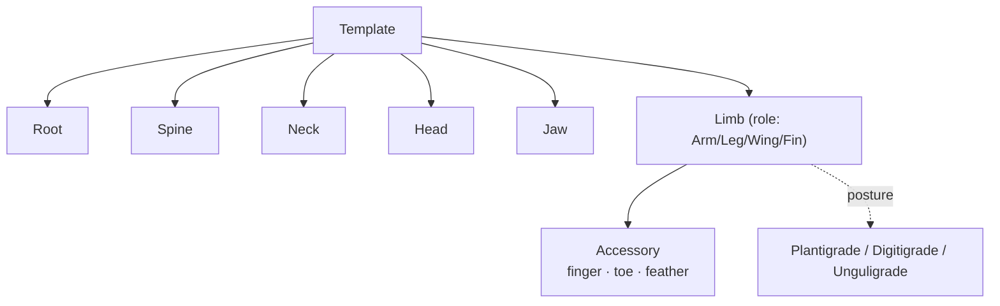

# R-4: Non-human rig conventions

**Status: resolved into the template model.** The taxonomy this survey set out
to find is already the shape of `crates/m2m-rig`'s template manifests. This
records what those conventions are, where they came from, and how they line up
with the tools artists know.

**Date:** 2026-09-01

## The question

How do Blender, Maya and Rigify handle the rig structures that a human skeleton
does not have — avian wing chains, fish spines, quadruped scapulae — and what
does a template need to describe to place them?

## What the templates already encode

A template is a set of typed bone chains. Two enums carry the taxonomy
(`crates/m2m-rig/src/template.rs`):

- **`ChainKind`** — `Root`, `Spine`, `Neck`, `Head`, `Jaw`, `Limb`, `Accessory`.
  The body axis (`Spine`) and the limbs (`Limb`) are the load-bearing kinds; a
  `Jaw` covers the mouth/fang chains bird, snake, spider and shark carry and the
  human does not; an `Accessory` is a chain hanging *off* a limb — a finger, a
  toe, or a bird's wing feathers, "not necessarily off its end" (a bird's
  feather chains hang part-way along the wing, on `wing_2` through `wing_5`).
- **`LimbRole`** — `Arm`, `Leg`, `Wing`, `Fin`. A limb's role is what tells the
  fitter and the pose-matcher (P3-P3) that a wing and a leg are the same kind of
  thing structurally, placed by the same rule but recognised as different limbs.
- **`Posture`** — `Plantigrade`, `Digitigrade`, `Unguligrade`. How a leg meets
  the ground, which decides *which joint the fitter grounds*: the sole (human,
  bear), the raised ankle standing on toes (dog, cat, bird), or the hoof tip at
  the very end of the limb (horse, deer). Grounding the foot bone of an
  unguligrade horse puts it through the floor — the posture is a real third
  category, added because the horse template could not be described without it.

## The three cases the survey named

**Avian wing chains.** The bird template's wing is a `Limb` with role `Wing`,
running shoulder → elbow → wrist and then the primary-feather `Accessory` chains
off the wrist and the mid-wing bones. This matches how Blender's rigging tools
and Rigify's "bird" metarig treat a wing: a three-segment arm analogue plus
feather chains, not a special primitive. Because the wing is just a `Limb`, the
pose-matcher reorients it by the same rule as an arm — verified: fitting the
bird onto its mesh reorients the wing bones ~30° (P3-P6).

**Fish spines.** A fish (the shark template) is a `Spine` from snout to tail
plus short `Limb` chains with role `Fin` for the dorsal, pectorals and tail. The
spine must carry enough segments to bend into a swimming curve — the guidance
copy (design.md §7, now shipped in the manifest) says so to the user. This is
the same convention Blender uses for a fish: one long deform chain along the
lateral line, fins as stubby limbs. The snake is the degenerate case — a `Spine`
and nothing else, no limbs at all.

**Quadruped scapulae.** The fox and horse front legs are `Limb`s with role
`Leg`, attaching at the shoulder blade, which sits higher up the body than the
visible "shoulder" — the guidance copy warns of exactly this. Rigify's
quadruped metarig models the scapula as the first bone of the front limb chain,
and the templates follow that: the limb chain starts at the scapula, not at the
humerus. The hock (the backwards-bending joint) falls out of the leg chain's
own geometry once the posture grounds the correct joint.

## Where this differs from Rigify deliberately

Rigify is GPL-2.0+; Mesh2Motion is MIT (architecture.md §8a, ADR A7). The
taxonomy above is **reimplemented from the anatomy**, not copied — the enum
shapes and the manifest layout are the project's own, and no Rigify metarig
coordinates or code were used. Rigify also ships control rigs (IK/FK switches,
pole targets); the templates here are **deform skeletons only**. A `Control`
chain kind was considered (buffalo pole targets justify it) and deliberately
not added, because nothing in the six-step flow drives a control rig yet.

## Outcome

No new work: the survey's question is answered by the model already in the code.
This doc is the reference for anyone adding a creature — pick the `ChainKind` per
chain, the `LimbRole` per limb, the `Posture` per leg, and write the guidance.
The one open extension is per-creature *rest-pose* ambiguity beyond the human
(wings folded vs spread, quadruped standing vs splayed), which P3-P6 handles
structurally but cannot yet *detect* without folded/spread reference meshes.
