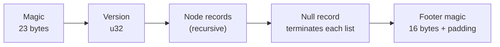

# R-6: FBX 7.4/7.5 binary write format

**Status: resolved and implemented.** The binary FBX writer exists
(`crates/m2m-io/src/fbx/encode.rs`, P2-6a). This records the container format it
targets, what it emits, and the gaps that remain — the spec questions R-6 set
out to answer, now answered from a working encoder rather than from the spec
alone (there is no official FBX spec; the format is reverse-engineered).

**Date:** 2026-09-01

## The container

A binary FBX file is a header, a tree of nodes, then a footer.

- **Magic** — the 23 bytes `Kaydara FBX Binary␠␠\x00\x1a\x00` (two trailing
  spaces, then the three-byte terminator). Constant `MAGIC` in `encode.rs`.
- **Version** — a `u32`. `7400` (FBX 2014/2015) and `7500` (FBX 2016+) are the
  two this project cares about. **The width of node offsets and counts changes
  at 7500**: below it they are 32-bit, from it 64-bit (`WIDE_OFFSETS_FROM =
  7500`). The reader rejects versions below `MIN_VERSION`; the writer emits
  whatever version the document carries and picks the offset width to match, so
  a document read from a 7400 file writes back as 7400.
- **Node record** — `end_offset` (the authoritative byte position where this
  node's scope ends), property count, property-list length, a one-byte name
  length, the name, the properties, then any nested nodes. A **null record** (a
  zeroed header) terminates each list of siblings, and an empty scope is a
  distinct thing from a scope containing a null record — the reader carries that
  `empty_scope` distinction and the writer preserves it.
- **Footer** — a fixed 16-byte magic (`FOOTER_MAGIC` in `encode.rs`), plus
  padding. The footer is checked on read because it is the only reliable way to
  tell a complete file from a truncated one: the end-of-content test is a
  heuristic on offsets, and a file cut inside the last root node parses to
  something structurally plausible while having silently lost data. Measured:
  cutting 578 bytes (0.03%) off the 2.1 MB reference rig dropped the entire
  `Takes` section — every animation stack — with no parse error.

## What the writer emits

`encode.rs` is the **exact inverse of `binary::parse`**, and deliberately only
the container half: turning scene data into an `FbxDocument` is a separate
concern (`build.rs`). That split buys the test that matters:
`parse(encode(parse(bytes)))` must equal `parse(bytes)` for every real file —
equality *through the document*, not the bytes, because the format has
legitimate freedoms (whether an array is deflated, how the footer is padded)
that change the bytes without changing the meaning.

- **Property arrays are deflated** when that is smaller (`encoding = 1`), which
  is what real exporters do; raw arrays (`encoding = 0`) are legal but ~2.5×
  larger. Nothing else about the container is simplified.
- **Node names** must fit in the single length byte — 255 bytes. The encoder
  errors rather than truncate (`MAX_NAME_LEN`).
- **Offsets** are recomputed on write to the version's width; the encoder errors
  only on data the format cannot represent (a name over 255 bytes, or a file so
  large an offset overflows the declared width).

## Known gaps

- **The document builders, not the container, are the frontier.** `encode.rs`
  round-trips any document faithfully; what a *rig export* writes into that
  document (Geometry, Deformer/Skin clusters, Model transforms, Takes) is
  `build.rs` and the rig adapter, and that is where semantic gaps live, not in
  the byte format.
- **No official spec exists.** Every constant here (magic, footer, version
  break at 7500, the null-record and empty-scope rules) is verified against real
  Mixamo exports, not against a document. New exporters (Maya, Max, Blender's
  FBX) can and do vary in what optional nodes they include; the reader tolerates
  what it has seen, and an unfamiliar file may carry nodes the reader skips.
- **Encryption / newer sub-versions** are out of scope. FBX has carried an
  obfuscation layer in some tool versions; none of the reference corpus uses it,
  and it is not handled.

## Outcome

The write format is understood well enough to round-trip every reference file
losslessly, which is the bar O4 sets (Maya/Blender read the export). R-6 is
closed; further FBX-export fidelity work is document-builder work tracked under
the P2/P3 export items, not container-format research.
