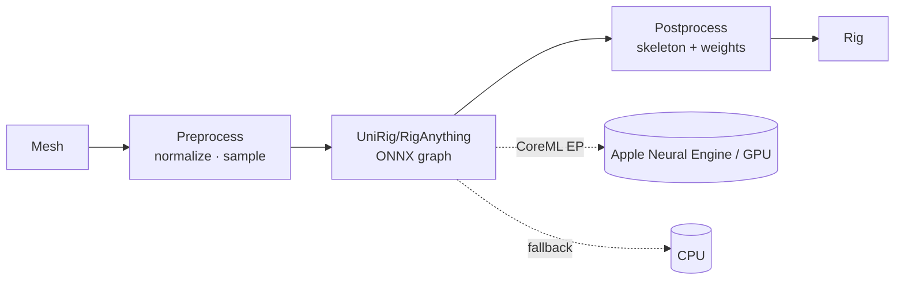

# R-7: UniRig / RigAnything via ONNX — feasibility

**Recommendation: do NOT pursue P4-6 now; keep it an opt-in behind a proven
need.** This is a feasibility framing, not a benchmark — the parts that would
need an actual UniRig export and an Apple-Silicon timing run are marked
**unverified** and would be the first work if the recommendation is ever
revisited.

**Date:** 2026-09-01 · **Informs:** P4-6 (UniRig ONNX opt-in via `ort` + CoreML EP)

## The question

Learned auto-riggers — UniRig, RigAnything — predict a skeleton and skin weights
directly from a mesh. Could one be exported to ONNX and run on Apple Silicon
through `ort` (the Rust ONNX Runtime binding) with the CoreML execution
provider, as an optional "AI rig" path beside the template + geodesic pipeline?

## What is already true (verified)

- **The existing pipeline meets every budget with room to spare.** Template fit
  + geodesic-voxel bind measured **307 ms / 44 MB at 48,670 vertices** — about
  10× under the 3 s time budget and 34× under the 1.5 GB memory budget
  (`test.md` §6, P1-11). It handles all nine shipped creatures and, since
  P3-P3/P3-P6, pose-mismatched and non-human rigs.
- **A GPU-heavy research path has already been rejected once, for platform.**
  R-3 (robust biharmonic skinning) resolved OUT because its implementation is
  PyTorch + custom CUDA + OptiX/OWL/Warp — NVIDIA-only on a project targeting
  Apple Silicon — and reported **71.74 s on the Bunny against a 3 s budget**.
  That is a different technique, but it establishes the bar: an approach that
  assumes an NVIDIA stack or blows the time budget does not ship here.

## What ONNX + `ort` + CoreML would require (the risk surface)

Each hop is a place the plan can fail, and none is verified here:

1. **Clean ONNX export.** These models are research PyTorch. Auto-riggers use
   ops that do not always export to a static ONNX graph — dynamic point sampling,
   graph/attention layers over variable vertex counts, custom CUDA kernels with
   no ONNX equivalent. **Unverified:** whether UniRig or RigAnything export to a
   single ONNX graph without hand-rewriting layers.
2. **CoreML EP coverage.** `ort`'s CoreML execution provider accelerates only
   the ops CoreML supports; anything else silently falls back to CPU. A model
   that falls back for its hot layers gets no Apple-Silicon speedup. **Unverified:**
   the op coverage for these specific graphs.
3. **Weights + dependency weight.** Model weights are typically tens to hundreds
   of MB — against a **40 MB** whole-app binary budget (`test.md` §6). They would
   have to ship as a separate optional download, not in the bundle. `ort` itself
   pulls in the ONNX Runtime native library, a large dependency for a tool whose
   whole point is being lean.
4. **Quality vs the geodesic bind.** The current bind is deterministic,
   inspectable (the weight-paint overlay), and already good enough that no
   creature falls back. A learned rig is a black box; when it is wrong there is
   no knob, only a re-run. **Unverified:** whether it is actually *better* on the
   creatures this app targets, which is the only thing that would justify it.

## Why the recommendation is "not now"

The value proposition is thin. Auto-riggers earn their keep when there is **no
template** — an arbitrary creature nobody has rigged. Mesh2Motion's premise is
the opposite: a curated set of typed templates that fit in under a second and
bind losslessly. Adding a several-hundred-MB neural path, a large native
runtime, and a black-box quality story to a pipeline that already meets budget
buys little and costs the leanness that is the product's advantage.

## When to revisit

- Users hit creatures no template covers and the template library (R-5/P3-13)
  cannot keep up — a genuine "rig anything" need.
- A specific model is shown (hands-on, not assumed) to export to ONNX cleanly
  and run its hot path on the CoreML EP within the time budget.

Until both hold, P4-6 stays optional and unimplemented. The first concrete step
if revisited is a spike: export one model, load it in `ort`, and time a single
forward pass on Apple Silicon — turning items 1 and 2 above from unverified into
measured.
