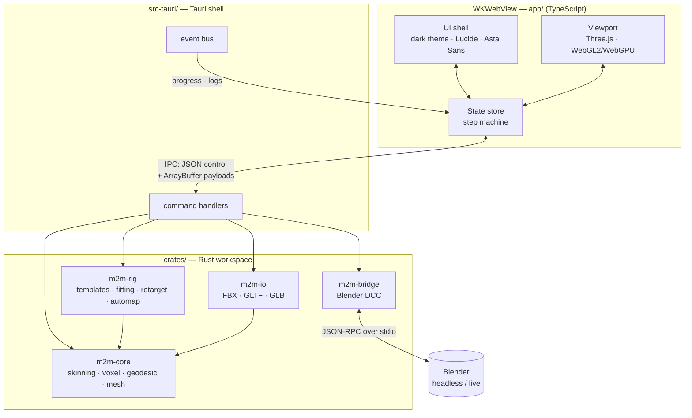
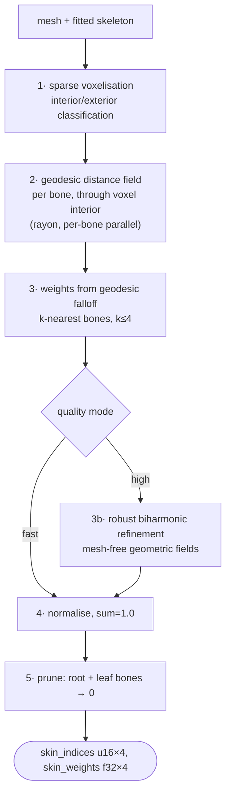
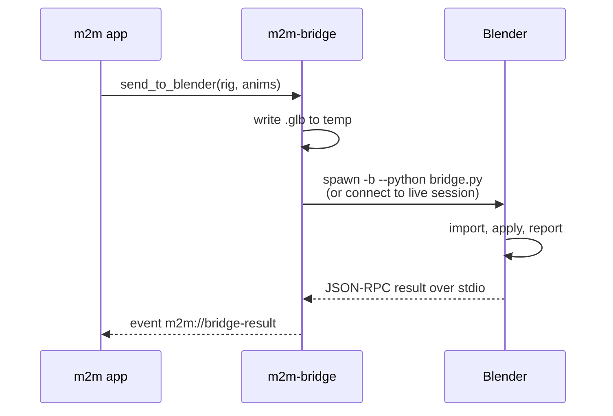

# Architecture

**Decision (2026-08-29, user-confirmed): Rust compute core + Three.js viewport in
the Tauri webview.** All heavy math is native; the viewport keeps Three.js so the
~3,000 LOC of working gizmo/picking/skeleton-helper code survives the port. The
renderer stays swappable — nothing in `m2m-core` knows what draws it.

## 1. System overview



## 2. Crate boundaries

| Crate | Depends on | Must NOT depend on | Responsibility |
|---|---|---|---|
| `m2m-core` | `glam`, `rayon` | tauri, serde_json, any I/O | pure geometry + solver. Plain data in, plain data out. |
| `m2m-io` | `m2m-core` | tauri | FBX read/write, GLTF/GLB read/write |
| `m2m-rig` | `m2m-core` | tauri | template defs, skeleton fitting, retargeting, bone auto-mapping |
| `m2m-bridge` | `m2m-io` | tauri | Blender process control + RPC |
| `src-tauri` | all | — | thin command layer. **No algorithms here.** |

**The rule that keeps this testable:** `m2m-core` is a library you can benchmark
from a `criterion` harness with no window, no webview, and no Tauri runtime. If a
change to `m2m-core` needs a running app to test, the change is in the wrong crate.

## 3. The skinning pipeline (new)

Replaces the legacy nearest-bone chain documented in `porting.md` §3.



**Why geodesic, not Euclidean.** Distance measured *through the mesh interior*
cannot jump across empty space. A hand resting near a hip is far away geodesically
even though it is close Euclidean. This single change removes the need for
`ExtremityWeightCorrector` and `ArmWeightCorrector` — they were patches for the
Euclidean failure mode. **Deleting them is a deliverable, not a side effect.**

**Why voxel, not tetrahedral.** Bounded Biharmonic Weights needs a volumetric tet
mesh, which fails on the non-watertight, self-intersecting meshes artists actually
have. Sparse voxelisation degrades gracefully. This is the documented reason Maya
ships Geodesic Voxel Binding.

References (verified 2026-08-29):
- Dionne & de Lasa, *Geodesic Voxel Binding for Production Character Meshes*, SCA 2013
- Dodik, Sitzmann, Solomon, Stein, *Robust Biharmonic Skinning Using Geometric Fields*, TOG 2025 — arXiv:2406.00238
- Jacobson et al., *Bounded Biharmonic Weights for Real-Time Deformation*, SIGGRAPH 2011

## 4. IPC contract

Two channels, deliberately separate:

| Channel | Carries | Mechanism |
|---|---|---|
| **Control** | commands, params, results, errors | Tauri `invoke`, serde JSON |
| **Bulk** | vertex/index/weight buffers | raw `ArrayBuffer` — never JSON |

**Never serialise a vertex buffer as JSON.** A 50k-vertex mesh is ~1.2 MB binary and
~9 MB as a JSON number array, and the parse cost dominates the solve. Buffers cross
as bytes with a small JSON header describing layout.

Long operations emit progress events rather than blocking:

```
invoke("bind_skin", {mesh_id, skeleton_id, quality})  →  job_id
event "m2m://progress"  {job_id, stage, pct}
event "m2m://done"      {job_id, buffer_handle}
```

## 5. Frontend structure (`app/`)

```
app/src/
  main.ts              entry, step machine (ports Mesh2MotionEngine.ts)
  ipc/                 typed wrappers over invoke — the ONLY place invoke is called
  viewport/            Three.js scene, camera, gizmos (ported from legacy/src/lib)
  steps/               one module per ProcessStep
  ui/                  components, Lucide icons, dialogs
  state/               single store; UI is a view over it
```

`ipc/` being the sole `invoke` caller is what makes the Rust boundary mockable in
frontend tests.

## 6. Blender bridge



Two modes: **headless** (spawn `/Applications/Blender.app/Contents/MacOS/Blender -b`,
used for automated visual regression in CI) and **live** (attach to a running
Blender with the companion add-on, for artist round-tripping).

## 7. Threading and memory

- Solver work runs on a `rayon` pool sized to `num_cpus - 1`, leaving a core for UI.
- The webview thread never blocks; every command over ~16 ms returns a `job_id`.
- Large buffers are owned by Rust and handed to JS as views. One owner, no copies.
- Voxel grids are the peak allocation; grid resolution is adaptive to the vertex
  budget so peak RSS stays inside the 1.5 GB budget in `philosophy.md`.

## 8. Security

- Tauri CSP locked down; no remote content loaded into the webview.
- Filesystem scope limited to user-selected paths via the dialog plugin.
- FBX/GLTF parsers are **hostile-input boundaries** — a malformed file must error,
  never panic, never OOM. Fuzz targets required (`test.md` §5).
- No telemetry, no network calls at runtime. Fonts and assets are vendored.

## 9. Architecture decision record

| # | Date | Decision | Rationale |
|---|---|---|---|
| A1 | 2026-08-29 | Rust core + Three.js viewport (not full wgpu) | preserves ~3k LOC of working interaction code; renderer stays swappable; fastest path to usable |
| A2 | 2026-08-29 | Geodesic voxel binding as default solver | removes the Euclidean failure mode that forced 3 per-body-part correctors; robust on non-watertight meshes |
| A3 | 2026-08-29 | Port the legacy FBX parser to Rust rather than use `fbxcel` | verified: `fbxcel` is binary-only, read-only, no ASCII, no export; `fbxcel-dom` is v0.0.6 |
| A4 | 2026-08-29 | Drop hand-rolled `Quat`/`Vec3`/`Transform`, use `glam` | 1,300 LOC deleted; `glam` is SIMD-optimised and battle-tested |
| A5 | 2026-08-29 | Neural rigging (UniRig) deferred to opt-in phase | ~1.5 GB RAM + ORT-from-source build conflicts with the resource budget; templates + geodesic solve first |
| A6 | 2026-08-29 | Binary IPC for buffers, JSON only for control | JSON vertex arrays are ~7× larger and parse-dominated |
