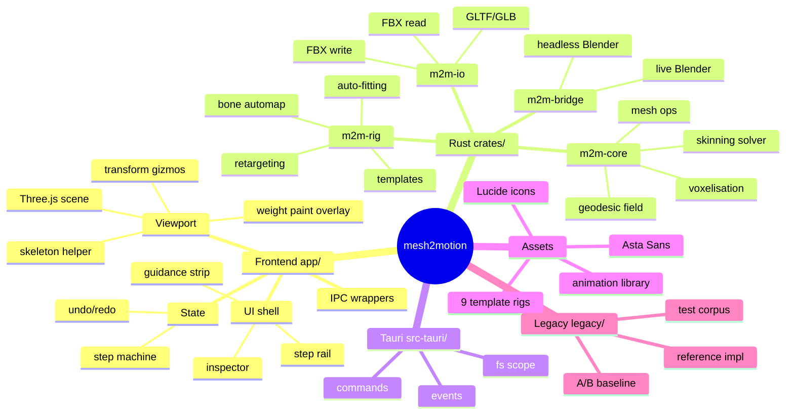
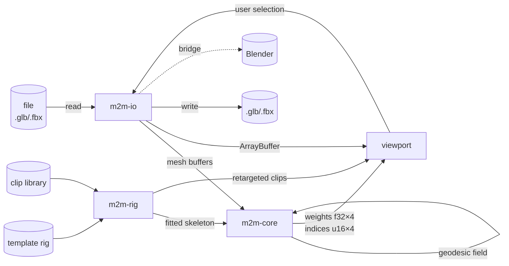
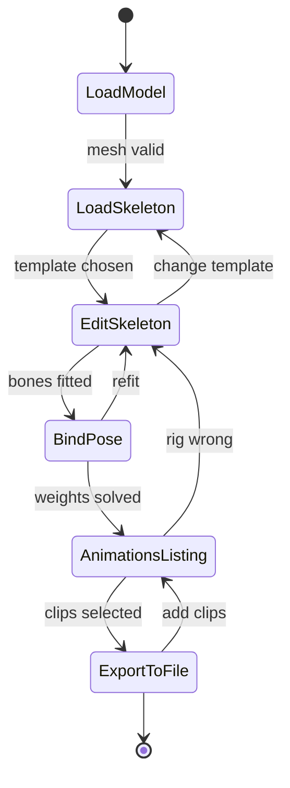

# System Mindmap

Living high-level map. Update whenever a module or dependency changes.
**Last updated: 2026-08-29 16:19:34**

## 1. Whole system

## 2. Dependency direction (must stay acyclic)

```mermaid
flowchart BT
    CORE[m2m-core] --> IO[m2m-io]
    CORE --> RIG[m2m-rig]
    IO --> BR[m2m-bridge]
    IO --> TAURI[src-tauri]
    RIG --> TAURI
    BR --> TAURI
    TAURI --> APP[app/ frontend]
    style CORE fill:#1e3a5f,stroke:#4a9eff
```

`m2m-core` depends on nothing in this project. That is the invariant CI enforces.

## 3. Data flow: model → rigged export

## 4. Step state machine

## 5. Key relationships worth remembering

- **`m2m-core` knows nothing about Three.js, Tauri, or files.** Break this and
  benchmarking and testing both collapse.
- **`legacy/` is a dependency of the test suite**, not dead code — it is the A/B
  baseline (`test.md` §9).
- **Templates are data, not code.** Adding a creature must not require Rust changes
  (`instruction.md` §6).
- **The three legacy weight correctors are scheduled for deletion**, not port —
  they are patches for the Euclidean-distance failure mode the geodesic solver
  removes (`architecture.md` §3).
- **`ipc/` is the only place `invoke` is called** — the seam that makes the
  frontend testable without Rust.

## 6. External dependencies

| Dependency | Version | Why | Risk |
|---|---|---|---|
| Rust | 1.96.0 ✅ | core | — |
| Node | 22.16.0 ✅ | frontend build | — |
| Tauri CLI | not installed ⚠️ | shell | todo P0-2 |
| Three.js | 0.185 | viewport | inherited from legacy |
| glam | tbd | SIMD math | replaces 1.3k LOC |
| rayon | tbd | parallel solve | — |
| Blender | `/Applications/Blender.app` ✅ | bridge + visual regression | version drift |
| SonarQube | not installed ⚠️ | quality gate | todo P0-6 |
| Asta Sans | vendored | typography | removed from Google Fonts — must vendor |
