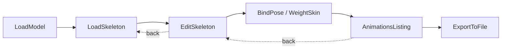
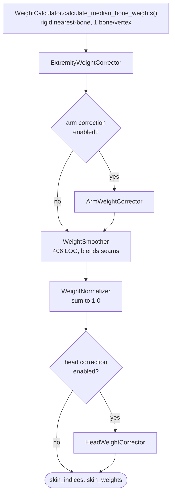

# Porting Reference — legacy TypeScript/Three.js → Tauri + Rust

Documents the **original implementation** in depth so the port is accurate rather
than reinvented. All line references verified 2026-08-29 against commit `1271226`.

> Source of truth is `legacy/`. It stays runnable for A/B comparison. Do not delete it.

## 1. Original stack

| Concern | Legacy |
|---|---|
| Language | TypeScript (`type: module`), 30,780 LOC / 148 files |
| Render | Three.js 0.185 |
| Build | Vite 8 |
| Test | Vitest 4 (partial — retarget + FBX parsers only) |
| Deploy | Cloudflare (`wrangler.jsonc`), Docker |
| FBX | hand-written parser, `src/lib/io/fbx/` |
| GLTF/GLB | Three.js `GLTFLoader` / `GLTFExporter` |
| FBX export | `@comfyorg/fbx-exporter-three` |

## 2. Process flow (`src/lib/enums/ProcessStep.ts`)

Orchestrated by `Mesh2MotionEngine.ts` (727 LOC). Step transitions at
`Mesh2MotionEngine.ts:323-436`; each step owns a `Step*` class under
`src/lib/processes/<step>/`.

| Step | Owner class | Responsibility |
|---|---|---|
| LoadModel | `processes/load-model/StepLoadModel.ts` | GLB/GLTF import, `ModelAnalysisReport` (810 LOC) validates mesh |
| LoadSkeleton | `processes/load-skeleton/StepLoadSkeleton.ts` | pick 1 of 9 templates, `PreviewSkeletonManager`, `HandHelper` |
| EditSkeleton | `processes/edit-skeleton/StepEditSkeleton.ts` (786) | fit bones into mesh; `MeshDragBonePlacement`, `IndependentBoneMovement`, `ArmPlaneManager`, `UndoRedoSystem` |
| BindPose | `lib/solvers/SkinningAlgorithm.ts` | **the skinning solve** — see §3 |
| AnimationsListing | `processes/animations-listing/StepAnimationsListing.ts` (531) | preview/select clips, `ArmExtensionControl`, `ModelVariationSwitcher` |
| ExportToFile | `processes/export-to-file/` | GLB/FBX out, bone renaming, hierarchy flattening |

## 3. The skinning pipeline — what is being replaced

`SkinningAlgorithm.calculate_indexes_and_weights()` orchestrates:

**The core defect.** `WeightCalculator.ts:71-80`: for each vertex, linear scan over
all bones, keep the single nearest by distance to `bone_midpoint_to_child`. One
bone per vertex, Euclidean distance, no volume awareness, no geodesic term.

Consequences, and why each corrector exists:
- Euclidean distance jumps across empty space → a hand near a hip grabs hip vertices → `ExtremityWeightCorrector`
- Arms hanging in A-pose run close to the ribcage → arm bones steal chest vertices → `ArmWeightCorrector`
- Head/neck boundary lands wrong → `HeadWeightCorrector`
- Hard one-bone assignment leaves visible seams → `WeightSmoother`

Each corrector is a per-body-part patch on a general algorithmic weakness. **This
is precisely why adding a new creature type is expensive today**, and why O2 in
`project_context.md` replaces the base algorithm rather than adding a tenth corrector.

`RigConfig.ts` and `BoneClassifier.ts` (119 LOC) supply the per-skeleton-type
knowledge the correctors key off.

## 4. Retargeting subsystem (`src/retarget/`)

Standalone page (`src/retarget/index.html`), not part of the main flow.

- `human-retargeting/` — own math types: `Quat.ts` (574), `Vec3.ts` (391), `Transform.ts` (352), `Retargeter.ts` (541)
- `bone-automap/` — maps arbitrary rig bone names onto canonical slots
  - `BoneNameTokenizer.ts` — splits `mixamorig:LeftUpLeg` into tokens
  - `BoneSlotVocabulary.ts` — canonical slot names
  - `MixamoMapper.ts`, `RigifyMapper.ts`, `Mesh2MotionMapper.ts` — per-convention adapters
  - `BoneChainResolver.ts` — resolves chains; `BoneCategoryMapper.ts` — torso/arm/leg/wing/tail
- `MultiRootSkeletonResolver.ts` — handles rigs with multiple root candidates

**This subsystem is the best-tested code in the project** (7 `.test.ts` files) and
its logic ports to Rust largely 1:1. The hand-rolled `Quat`/`Vec3`/`Transform`
types are replaced by `glam` — do not port them.

## 5. FBX parser (`src/lib/io/fbx/`, ~4,100 LOC)

| File | LOC | Role |
|---|---|---|
| `FBXTreeParser.ts` | 1620 | node graph → Three.js objects |
| `GeometryParser.ts` | 985 | vertices, normals, UVs, skin clusters |
| `AnimationParser.ts` | 783 | animation curves → clips |
| `TextParser.ts` | 390 | ASCII FBX |
| `BinaryParser.ts` / `BinaryReader.ts` | — | binary FBX |
| `fbx-utils.ts` | 364 | shared helpers |

**Port this, do not replace it with a crate.** Verified 2026-08-29: `fbxcel` is
binary-only, read-only, no ASCII, no export; `fbxcel-dom` is v0.0.6. This parser
handles ASCII *and* binary and is proven against real Mixamo files. Its behaviour
is the spec; port file-by-file with the existing tests as the harness.

FBX **export** currently comes from `@comfyorg/fbx-exporter-three`. There is no
Rust equivalent — writing the FBX writer is net-new work (`todo.md` P2).

## 6. Assets (`legacy/static/`, 55 MB)

- `rigs/` — 9 template rigs, one per `SkeletonType`. Note `SkeletonType.Fish` → `rig-shark.glb`.
- `models/` — 9 matching demo meshes
- `models-variation/` — 18 variants driving `ModelVariationSwitcher`
- `animations/`, `animpreviews/` — clip library + 470 preview `.mp4`s
- `test-files/` — **regression corpus, high value**: interleaved-buffer mesh, missing-texture zips, wrong-bone-count/wrong-bone-name custom animations, `mixamo-original-rig.fbx`, A-pose correction cases

`references/human_based_fbx_mixamo_animations/` — 7 Mixamo run-cycle `.fbx` files,
the FBX import/export round-trip corpus.

## 7. Port mapping

| Legacy | Destination | Notes |
|---|---|---|
| `lib/solvers/*` | `crates/m2m-core/src/skinning/` | **rewrite, not port** — new algorithm (O2) |
| `lib/io/fbx/*` | `crates/m2m-io/src/fbx/` | port 1:1, tests first |
| `retarget/human-retargeting/{Quat,Vec3,Transform}` | — | **drop**, use `glam` |
| `retarget/human-retargeting/Retargeter.ts` | `crates/m2m-rig/src/retarget/` | port logic |
| `retarget/bone-automap/*` | `crates/m2m-rig/src/automap/` | port 1:1 incl. tests |
| `lib/RigConfig.ts`, `BoneClassifier.ts` | `crates/m2m-rig/src/templates/` | becomes data-driven template defs |
| `Mesh2MotionEngine.ts`, `processes/*` | `app/src/` | stays TypeScript, calls Rust over IPC |
| `lib/components/CustomTransformControls.ts` | `app/src/` | stays TypeScript (1407 LOC of working gizmo code) |
| `preview-generator/` | keep in `legacy/` | internal tool, port only if needed |

## 8. Behavioural baselines to preserve

Regression targets — the new implementation must match or beat `legacy/` on each:

1. All 9 templates bind without NaN weights and every vertex sums to 1.0
2. Root bone and leaf/orientation bones receive **zero** weight (`WeightCalculator.initialize_caches()`)
3. Mixamo FBX imports produce the same bone count and clip duration
4. Bone auto-mapping test fixtures in `bone-automap/rig-fixtures.ts` all still pass
5. Exported GLB opens in Blender with the skeleton intact
